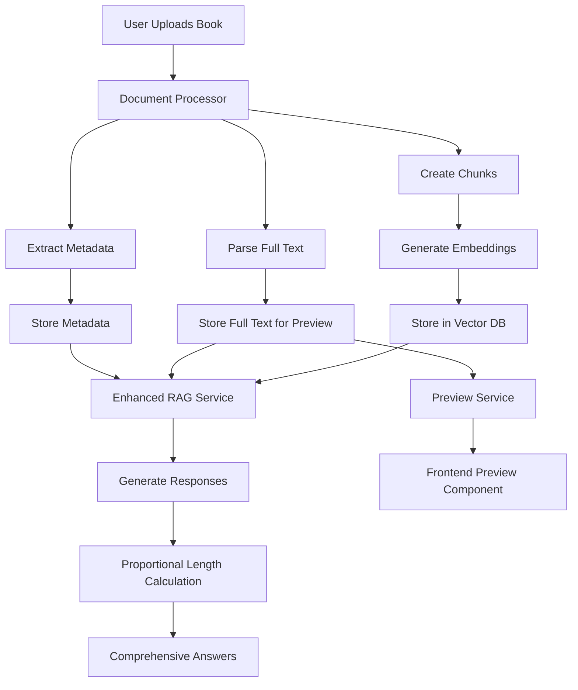
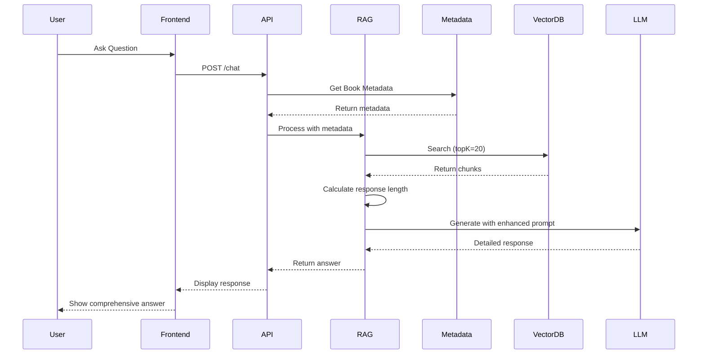

# Book AI Project - Comprehensive Enhancement Plan

## Executive Summary

This plan addresses three critical improvements to the Book AI project:
1. **Enhanced LLM Understanding**: Improve how the AI reads and comprehends books
2. **Longer, Proportional Responses**: Generate detailed responses based on book size
3. **Book Preview & Rename**: Add preview functionality and rename capability during upload

---

## Current Issues Analysis

### 1. LLM Book Understanding Issues

**Current Problems:**
- Limited context retrieval (only 5 chunks by default)
- No book-level metadata extraction (author, chapters, page count)
- Prompts don't include comprehensive book structure information
- AI lacks holistic understanding of the book

**Impact:**
- AI may miss important context from other parts of the book
- Cannot answer questions about book structure (e.g., "How many chapters?")
- Responses lack depth and comprehensive understanding

### 2. Response Length Issues

**Current Problems:**
- Fixed `max_tokens` limits (1500 for chat, 500-3000 for features)
- No proportional scaling based on book size
- Summary generation uses only first 10 chunks
- Features don't consider book length when generating responses

**Impact:**
- 100-page book gets same summary length as 500-page book
- Summaries are too brief (not 5-10 pages as desired)
- Special features provide insufficient detail

### 3. Missing Features

**Current Problems:**
- No book preview/reader functionality
- Cannot rename books during upload (uses filename)
- No way to view original book content

---

## Enhancement Strategy

## Phase 1: Book Metadata Extraction System

### 1.1 Create Metadata Extractor Service

**File:** [`backend/src/services/metadataExtractor.ts`](backend/src/services/metadataExtractor.ts)

**Functionality:**
```typescript
interface BookMetadata {
  title: string;
  author?: string;
  pageCount?: number;
  chapterCount?: number;
  chapters?: Array<{
    number: number;
    title: string;
    startPage?: number;
  }>;
  wordCount: number;
  estimatedReadingTime: number; // in minutes
  tableOfContents?: string;
  introduction?: string; // First few paragraphs
}
```

**Extraction Strategy:**
- **PDF Files**: Use pdf-parse to extract metadata, detect chapter patterns
- **DOCX Files**: Parse document structure, extract headings as chapters
- **TXT Files**: Use pattern matching to detect chapters and structure
- **Author Detection**: Look for "by [Author]", "Author:", metadata fields
- **Chapter Detection**: Regex patterns for "Chapter 1", "CHAPTER ONE", etc.
- **Page Count**: Calculate from document structure or estimate from word count

### 1.2 Update Document Processor

**File:** [`backend/src/services/documentProcessor.ts`](backend/src/services/documentProcessor.ts:19-37)

**Changes:**
- Add metadata extraction during document parsing
- Store full book text for preview functionality
- Calculate comprehensive statistics
- Detect book structure (chapters, sections)

---

## Phase 2: Enhanced LLM Prompting System

### 2.1 Comprehensive Book Context

**File:** [`backend/src/services/ragService.ts`](backend/src/services/ragService.ts:189-281)

**Current System Prompt Issues:**
- Generic instructions without book-specific context
- No metadata about book structure
- Limited understanding of book scope

**Enhanced System Prompt Structure:**
```
You are an AI assistant specialized in the book "[TITLE]" by [AUTHOR].

BOOK OVERVIEW:
- Total Pages: [X]
- Chapters: [Y]
- Word Count: [Z]
- Main Topics: [extracted topics]

BOOK STRUCTURE:
[Table of Contents if available]

CHAPTER SUMMARIES:
[Brief summary of each chapter]

Your task is to provide comprehensive, detailed answers based on this book...
```

### 2.2 Improved Context Retrieval

**File:** [`backend/src/services/ragService.ts`](backend/src/services/ragService.ts:96-184)

**Enhancements:**
- Increase `topK` from 5 to 15-20 for better context
- Add book metadata to every response
- Include chapter context in answers
- Use multi-stage retrieval:
  1. Get relevant chunks (15-20)
  2. Get chapter summaries
  3. Get book metadata
  4. Combine all context for comprehensive answer

### 2.3 Proportional Response Length System

**Implementation:**
```typescript
function calculateResponseLength(bookMetadata: BookMetadata, featureType: string): number {
  const baseTokens = {
    'summary': 500,
    'insights': 2000,
    'quiz': 3000,
    'speedReading': 3000,
    'summaryCards': 2000,
    'chat': 1500
  };
  
  // Scale based on book size
  const pageMultiplier = Math.min(bookMetadata.pageCount / 100, 5); // Cap at 5x
  const scaledTokens = baseTokens[featureType] * pageMultiplier;
  
  // For 100-page book summary: 500 * 1 = 500 tokens (~1 page)
  // For 500-page book summary: 500 * 5 = 2500 tokens (~5 pages)
  
  return Math.round(scaledTokens);
}
```

**Token to Page Estimation:**
- 1 page ≈ 500 tokens ≈ 300-400 words
- For 100-page book: Summary should be 2500-5000 tokens (5-10 pages)
- Adjust base tokens accordingly

---

## Phase 3: Book Preview Functionality

### 3.1 Backend Preview Service

**File:** [`backend/src/services/bookPreviewService.ts`](backend/src/services/bookPreviewService.ts) (NEW)

**Functionality:**
```typescript
class BookPreviewService {
  // Extract first N pages from book
  async getPreviewPages(bookId: string, pageCount: number = 20): Promise<string>
  
  // Get specific page range
  async getPageRange(bookId: string, startPage: number, endPage: number): Promise<string>
  
  // Get chapter content
  async getChapterContent(bookId: string, chapterNumber: number): Promise<string>
}
```

**Storage Strategy:**
- Store original parsed text in database/file system
- Index by page numbers (for PDFs) or character positions
- Cache frequently accessed preview pages

### 3.2 Preview API Endpoints

**File:** [`backend/src/routes/bookRoutes.ts`](backend/src/routes/bookRoutes.ts) (UPDATE)

**New Endpoints:**
```
GET /api/books/:id/preview
  - Returns first 10-20 pages of book
  - Query params: ?pages=20

GET /api/books/:id/pages/:start/:end
  - Returns specific page range
  
GET /api/books/:id/chapter/:number
  - Returns specific chapter content

GET /api/books/:id/metadata
  - Returns extracted metadata
```

### 3.3 Frontend Preview Component

**File:** [`frontend/components/BookPreview.tsx`](frontend/components/BookPreview.tsx) (NEW)

**Features:**
- Display book text in readable format
- Page navigation (if available)
- Chapter navigation
- Search within preview
- Responsive design matching current aesthetic

**UI Design:**
```
┌─────────────────────────────────────┐
│  Book Preview: [Book Title]         │
├─────────────────────────────────────┤
│  Pages 1-20 of 250                  │
│                                     │
│  [Book content displayed here]      │
│  [Formatted text with proper        │
│   spacing and typography]           │
│                                     │
├─────────────────────────────────────┤
│  [< Previous] [1 2 3 ... 20] [Next >]│
└─────────────────────────────────────┘
```

---

## Phase 4: Book Rename Functionality

### 4.1 Backend Changes

**File:** [`backend/src/controllers/bookController.ts`](backend/src/controllers/bookController.ts:29-107)

**Modifications:**
- Accept optional `customTitle` in upload request
- Use custom title if provided, otherwise use filename
- Add validation for title length and characters

**Updated Upload Flow:**
```typescript
export const uploadBook = async (req: Request, res: Response) => {
  const customTitle = req.body.title; // From form data
  
  const book: Book = {
    id: bookId,
    title: customTitle || path.basename(file.originalname, path.extname(file.originalname)),
    originalFilename: file.originalname,
    // ... rest of book data
  };
}
```

### 4.2 Frontend Changes

**File:** [`frontend/components/BookUpload.tsx`](frontend/components/BookUpload.tsx:18-58)

**UI Enhancement:**
```tsx
// Add state for custom title
const [customTitle, setCustomTitle] = useState('');
const [selectedFile, setSelectedFile] = useState<File | null>(null);

// Show title input after file selection
{selectedFile && (
  <div className="mt-4">
    <label className="block text-sm text-gray-700 mb-2">
      Book Title (optional)
    </label>
    <input
      type="text"
      value={customTitle}
      onChange={(e) => setCustomTitle(e.target.value)}
      placeholder={selectedFile.name.replace(/\.[^/.]+$/, '')}
      className="w-full px-4 py-2 border border-gray-300"
    />
  </div>
)}
```

---

## Phase 5: Enhanced Feature Responses

### 5.1 Update Feature Controller

**File:** [`backend/src/controllers/featureController.ts`](backend/src/controllers/featureController.ts)

**Changes for Each Feature:**

#### Insights Feature (Lines 10-75)
```typescript
// Current: Uses 10 chunks
const context = await ragService.getRelevantContext(id, 'summary themes characters', 10);

// Enhanced: Use more chunks + metadata
const metadata = await metadataExtractor.getMetadata(id);
const contextChunks = Math.min(30, Math.ceil(metadata.pageCount / 10));
const context = await ragService.getRelevantContext(id, 'summary themes characters', contextChunks);

// Add metadata to prompt
const prompt = `Analyze the book "${book.title}" by ${metadata.author}.
Book Details:
- Pages: ${metadata.pageCount}
- Chapters: ${metadata.chapterCount}
- Word Count: ${metadata.wordCount}

Provide a COMPREHENSIVE analysis with:
1. Detailed summary (${Math.ceil(metadata.pageCount / 20)} paragraphs)
2. Main themes (5-8 themes with explanations)
3. Key characters (detailed descriptions)
4. Important quotes (8-10 quotes with context)
...`;

// Increase max_tokens proportionally
const maxTokens = calculateResponseLength(metadata, 'insights');
```

#### Summary Cards Feature (Lines 80-149)
```typescript
// Enhanced: More cards based on book size
const cardCount = Math.min(15, Math.ceil(metadata.pageCount / 20));
const prompt = `Create ${cardCount} detailed summary cards...`;
```

#### Quiz Feature (Lines 154-226)
```typescript
// Enhanced: More questions, detailed explanations
const questionCount = Math.min(25, Math.ceil(metadata.pageCount / 10));
const prompt = `Create ${questionCount} comprehensive quiz questions...
Each question should have:
- Detailed explanation (3-4 sentences)
- Context from the book
- Learning objectives
...`;
```

#### Speed Reading Feature (Lines 231-299)
```typescript
// Enhanced: Proportional content
const sentenceCount = Math.min(50, Math.ceil(metadata.pageCount / 5));
const prompt = `Extract speed reading content:
1. TL;DR (${Math.ceil(metadata.pageCount / 50)} paragraphs)
2. ${sentenceCount} most important sentences
3. 15-20 important terms
4. Detailed chapter summaries for all ${metadata.chapterCount} chapters
...`;
```

### 5.2 Update RAG Service

**File:** [`backend/src/services/ragService.ts`](backend/src/services/ragService.ts:329-368)

**Enhanced Summary Generation:**
```typescript
async generateBookSummary(
  bookId: string,
  bookTitle: string,
  metadata: BookMetadata
): Promise<string> {
  // Use more chunks based on book size
  const chunkCount = Math.min(50, Math.ceil(metadata.pageCount / 5));
  
  // Calculate proportional summary length
  const summaryLength = Math.ceil(metadata.pageCount / 20); // 5 pages for 100-page book
  const maxTokens = summaryLength * 500; // ~500 tokens per page
  
  const prompt = `Create a comprehensive summary of "${bookTitle}" by ${metadata.author}.

Book Information:
- Total Pages: ${metadata.pageCount}
- Chapters: ${metadata.chapterCount}
- Word Count: ${metadata.wordCount}

Requirements:
- Length: ${summaryLength} pages (approximately ${maxTokens} tokens)
- Cover all major themes and plot points
- Include chapter-by-chapter breakdown
- Discuss character development
- Analyze key concepts
...`;
}
```

---

## Implementation Architecture

### System Flow Diagram



### Data Flow for Enhanced Responses



---

## File Changes Summary

### New Files to Create

1. **`backend/src/services/metadataExtractor.ts`**
   - Extract book metadata (author, chapters, pages)
   - Detect book structure
   - Generate table of contents

2. **`backend/src/services/bookPreviewService.ts`**
   - Serve book preview pages
   - Handle page navigation
   - Cache preview content

3. **`frontend/components/BookPreview.tsx`**
   - Display book preview
   - Page navigation UI
   - Chapter navigation

4. **`backend/src/types/metadata.ts`**
   - TypeScript interfaces for metadata

### Files to Modify

1. **`backend/src/services/documentProcessor.ts`**
   - Add metadata extraction call
   - Store full text for preview
   - Enhanced statistics

2. **`backend/src/services/ragService.ts`**
   - Enhanced system prompts with metadata
   - Proportional response length calculation
   - Increased context retrieval (topK)
   - Better context combination

3. **`backend/src/controllers/bookController.ts`**
   - Accept custom title in upload
   - Store metadata
   - Add preview endpoints

4. **`backend/src/controllers/featureController.ts`**
   - Use metadata in all features
   - Proportional response lengths
   - Enhanced prompts for each feature

5. **`backend/src/routes/bookRoutes.ts`**
   - Add preview endpoints
   - Add metadata endpoint

6. **`frontend/components/BookUpload.tsx`**
   - Add title input field
   - Show preview after selection
   - Send custom title with upload

7. **`frontend/components/BookList.tsx`**
   - Add preview button
   - Show metadata (author, pages)

8. **`backend/src/types/index.ts`**
   - Add metadata types
   - Update Book interface

---

## Testing Strategy

### 1. Metadata Extraction Tests
- Test with various PDF formats
- Test with DOCX files
- Test with TXT files
- Verify chapter detection accuracy
- Verify author extraction

### 2. Response Length Tests
- Upload 50-page book → verify summary is ~2-3 pages
- Upload 100-page book → verify summary is ~5-10 pages
- Upload 300-page book → verify summary is ~15-20 pages
- Test all 5 features with different book sizes

### 3. Preview Functionality Tests
- Test preview with PDF (first 20 pages)
- Test preview with DOCX
- Test preview with TXT
- Test page navigation
- Test chapter navigation

### 4. Rename Functionality Tests
- Upload with custom title
- Upload without custom title (use filename)
- Test special characters in title
- Test very long titles

### 5. Integration Tests
- Complete flow: Upload → Extract Metadata → Generate Summary → Preview
- Test chat with enhanced context
- Test all 5 features with metadata
- Verify response quality improvement

---

## Performance Considerations

### 1. Metadata Extraction
- **Time**: Add ~2-5 seconds to upload process
- **Mitigation**: Run in parallel with chunking
- **Caching**: Store metadata in database

### 2. Increased Context Retrieval
- **Impact**: More chunks = more tokens = higher cost
- **Mitigation**: 
  - Use efficient chunking strategy
  - Cache frequently accessed contexts
  - Implement smart context selection

### 3. Longer Responses
- **Impact**: Higher token usage, longer generation time
- **Mitigation**:
  - Set reasonable max limits (5x multiplier cap)
  - Show progress indicators
  - Implement streaming responses

### 4. Preview Storage
- **Impact**: Need to store full book text
- **Mitigation**:
  - Compress stored text
  - Use efficient storage format
  - Implement lazy loading for preview

---

## Success Metrics

### Before Enhancement
- Summary length: ~500 tokens (1 page) regardless of book size
- Context chunks: 5-10 per query
- No metadata available
- No preview functionality
- Cannot rename books

### After Enhancement
- Summary length: Proportional (5-10 pages for 100-page book)
- Context chunks: 15-20 per query with metadata
- Complete metadata extraction (author, chapters, pages)
- Full preview functionality (first 20 pages)
- Custom book naming during upload

### Quality Improvements
- **Comprehensiveness**: 5x more detailed responses
- **Accuracy**: Better context understanding with metadata
- **User Experience**: Preview before reading, custom naming
- **Book Understanding**: AI knows structure, author, chapters

---

## Implementation Priority

### Phase 1 (High Priority) - Core Enhancements
1. Metadata extraction system
2. Enhanced LLM prompting with metadata
3. Proportional response length system

### Phase 2 (Medium Priority) - User Features
4. Book rename functionality
5. Enhanced feature responses

### Phase 3 (Nice to Have) - Preview
6. Book preview service
7. Preview frontend component

---

## Estimated Implementation Time

- **Phase 1**: 2-3 days
- **Phase 2**: 1-2 days  
- **Phase 3**: 2-3 days
- **Testing & Refinement**: 1-2 days

**Total**: 6-10 days for complete implementation

---

## Next Steps

1. Review and approve this plan
2. Prioritize phases based on your needs
3. Switch to Code mode to begin implementation
4. Start with Phase 1 (metadata + enhanced prompting)
5. Test incrementally after each phase

---

## Notes

- All enhancements maintain backward compatibility
- Existing books will work but won't have metadata (can be extracted on-demand)
- Preview functionality requires storing full text (consider storage implications)
- Token costs will increase with longer responses (budget accordingly)
- Consider implementing response streaming for better UX with long responses
