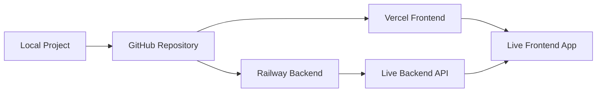

# 🚀 Book AI Project - Cloud Deployment Guide

Complete guide to deploy your Book AI project to the cloud using **Vercel** (frontend) and **Railway** (backend).

## 📋 Prerequisites

Before starting, ensure you have:
- ✅ Your Book AI project working locally
- ✅ Git installed on your computer
- ✅ GitHub account (free)
- ✅ Valid OpenAI API key (already in your `.env`)
- ✅ Node.js 18+ installed

## 🎯 Deployment Overview



**Architecture:**
- **Frontend**: Vercel (Next.js hosting with CDN)
- **Backend**: Railway (Node.js API with persistent storage)
- **Database**: ChromaDB (file-based, stored on Railway)
- **Files**: Uploaded books stored on Railway

---

## 📝 Step 1: Set Up Git Repository

### 1.1 Initialize Git (if not already done)

```bash
cd book-ai-project
git init
```

### 1.2 Create `.gitignore` file

Create a file named `.gitignore` in the project root:

```gitignore
# Dependencies
node_modules/
.pnp
.pnp.js

# Testing
coverage/

# Next.js
frontend/.next/
frontend/out/
frontend/build/

# Production
backend/dist/
backend/build/

# Environment variables
.env
.env.local
.env.production
.env.development.local
.env.test.local
.env.production.local

# Debug logs
npm-debug.log*
yarn-debug.log*
yarn-error.log*

# OS files
.DS_Store
Thumbs.db

# IDE
.vscode/
.idea/
*.swp
*.swo

# Uploads and databases
backend/uploads/*
!backend/uploads/.gitkeep
backend/chroma_db/
backend/vector_store/

# Misc
*.log
.cache/
```

### 1.3 Create placeholder files

```bash
# Create .gitkeep to preserve empty directories
mkdir -p backend/uploads
touch backend/uploads/.gitkeep
```

### 1.4 Commit your code

```bash
git add .
git commit -m "Initial commit - Book AI project ready for deployment"
```

### 1.5 Create GitHub Repository

1. Go to [GitHub](https://github.com)
2. Click the **"+"** icon → **"New repository"**
3. Repository name: `book-ai-project`
4. Description: "AI-powered book chat application with RAG"
5. Keep it **Public** (or Private if you prefer)
6. **DO NOT** initialize with README (we already have code)
7. Click **"Create repository"**

### 1.6 Push to GitHub

```bash
# Replace YOUR_USERNAME with your GitHub username
git remote add origin https://github.com/YOUR_USERNAME/book-ai-project.git
git branch -M main
git push -u origin main
```

✅ **Checkpoint**: Your code should now be visible on GitHub!

---

## 🚂 Step 2: Deploy Backend to Railway

### 2.1 Create Railway Account

1. Go to [Railway.app](https://railway.app)
2. Click **"Login"** → **"Login with GitHub"**
3. Authorize Railway to access your GitHub account
4. Complete the signup process

### 2.2 Create New Project

1. Click **"New Project"**
2. Select **"Deploy from GitHub repo"**
3. Choose your `book-ai-project` repository
4. Railway will detect it's a monorepo

### 2.3 Configure Backend Service

1. Click **"Add variables"** or go to **Variables** tab
2. Add the following environment variables:

```env
PORT=3001
BOB_API_KEY=your_openai_api_key_here
BOB_API_URL=https://api.openai.com/v1
CHROMA_DB_PATH=./chroma_db
UPLOAD_DIR=./uploads
MAX_FILE_SIZE=52428800
CHUNK_SIZE=1000
CHUNK_OVERLAP=200
TOP_K_RESULTS=5
NODE_OPTIONS=--max-old-space-size=4096
```

### 2.4 Configure Build Settings

1. Go to **Settings** tab
2. Set **Root Directory**: `backend`
3. Set **Build Command**: `npm install && npm run build`
4. Set **Start Command**: `npm start`
5. Click **"Save"**

### 2.5 Add Railway Configuration File

Create `backend/railway.json`:

```json
{
  "$schema": "https://railway.app/railway.schema.json",
  "build": {
    "builder": "NIXPACKS",
    "buildCommand": "npm install && npm run build"
  },
  "deploy": {
    "startCommand": "npm start",
    "restartPolicyType": "ON_FAILURE",
    "restartPolicyMaxRetries": 10
  }
}
```

### 2.6 Enable Persistent Storage (Important!)

1. In Railway dashboard, click your backend service
2. Go to **"Settings"** → **"Volumes"**
3. Click **"New Volume"**
4. Mount path: `/app/uploads`
5. Click **"Add"**
6. Add another volume:
   - Mount path: `/app/chroma_db`
7. Click **"Add"**

### 2.7 Deploy Backend

1. Railway will automatically deploy after configuration
2. Wait for deployment to complete (2-5 minutes)
3. Once deployed, click **"Settings"** → **"Networking"**
4. Click **"Generate Domain"**
5. Copy your backend URL (e.g., `https://book-ai-backend-production.up.railway.app`)

✅ **Checkpoint**: Test your backend by visiting `YOUR_BACKEND_URL/api/books` - you should see an empty array `[]`

---

## ⚡ Step 3: Deploy Frontend to Vercel

### 3.1 Create Vercel Account

1. Go to [Vercel.com](https://vercel.com)
2. Click **"Sign Up"**
3. Choose **"Continue with GitHub"**
4. Authorize Vercel to access your GitHub account

### 3.2 Import Project

1. Click **"Add New..."** → **"Project"**
2. Find and select your `book-ai-project` repository
3. Click **"Import"**

### 3.3 Configure Project Settings

1. **Framework Preset**: Next.js (auto-detected)
2. **Root Directory**: Click **"Edit"** → Select `frontend`
3. **Build Command**: `npm run build` (default)
4. **Output Directory**: `.next` (default)

### 3.4 Add Environment Variables

Click **"Environment Variables"** and add:

```env
NEXT_PUBLIC_API_URL=https://your-backend-url.up.railway.app
```

**Important**: Replace `your-backend-url.up.railway.app` with your actual Railway backend URL from Step 2.7!

### 3.5 Deploy Frontend

1. Click **"Deploy"**
2. Wait for deployment (1-3 minutes)
3. Once complete, Vercel will show your live URL
4. Click **"Visit"** to see your deployed app!

✅ **Checkpoint**: Your frontend should be live! Try uploading a book and chatting with it.

---

## 🔧 Step 4: Post-Deployment Configuration

### 4.1 Update Backend CORS

The backend needs to allow requests from your Vercel domain. Create `backend/src/config/cors.ts`:

```typescript
export const corsOptions = {
  origin: [
    'http://localhost:3000',
    'https://your-vercel-app.vercel.app', // Replace with your Vercel URL
    /\.vercel\.app$/ // Allow all Vercel preview deployments
  ],
  credentials: true,
  optionsSuccessStatus: 200
};
```

Update `backend/src/server.ts` to use this configuration:

```typescript
import cors from 'cors';
import { corsOptions } from './config/cors';

app.use(cors(corsOptions));
```

Commit and push:

```bash
git add .
git commit -m "Update CORS for production"
git push
```

Railway will automatically redeploy.

### 4.2 Test Complete Flow

1. Visit your Vercel URL
2. Upload a test book (PDF, TXT, or DOCX)
3. Wait for processing
4. Ask questions about the book
5. Verify responses are accurate

---

## 📊 Step 5: Monitoring & Maintenance

### 5.1 Railway Monitoring

- **Logs**: Railway dashboard → Your service → **"Logs"** tab
- **Metrics**: View CPU, memory, and network usage
- **Deployments**: See deployment history and rollback if needed

### 5.2 Vercel Monitoring

- **Analytics**: Vercel dashboard → Your project → **"Analytics"**
- **Logs**: View function logs and errors
- **Deployments**: See all deployments and preview URLs

### 5.3 Set Up Alerts (Optional)

**Railway:**
1. Go to project settings
2. Enable **"Deployment Notifications"**
3. Connect to Discord/Slack for alerts

**Vercel:**
1. Project settings → **"Notifications"**
2. Enable email notifications for failed deployments

---

## 🔐 Security Best Practices

### ✅ Completed
- ✅ Environment variables stored securely (not in code)
- ✅ `.gitignore` prevents sensitive files from being committed
- ✅ CORS configured to allow only your domains

### 🔒 Additional Recommendations

1. **Rotate API Keys Regularly**
   - Update OpenAI API key every 3-6 months
   - Update in Railway environment variables

2. **Enable Rate Limiting** (Future Enhancement)
   ```typescript
   // Add to backend
   import rateLimit from 'express-rate-limit';
   
   const limiter = rateLimit({
     windowMs: 15 * 60 * 1000, // 15 minutes
     max: 100 // limit each IP to 100 requests per windowMs
   });
   
   app.use('/api/', limiter);
   ```

3. **Add Authentication** (Future Enhancement)
   - Implement user accounts
   - Protect API endpoints
   - Use JWT tokens

---

## 🐛 Troubleshooting

### Backend Issues

**Problem**: Backend deployment fails
- **Solution**: Check Railway logs for errors
- Verify all environment variables are set
- Ensure `package.json` has correct scripts

**Problem**: "Cannot connect to backend"
- **Solution**: Verify Railway backend URL in Vercel environment variables
- Check CORS configuration
- Ensure Railway service is running

**Problem**: File uploads fail
- **Solution**: Verify persistent volumes are mounted
- Check `MAX_FILE_SIZE` environment variable
- Review Railway logs for errors

### Frontend Issues

**Problem**: Frontend build fails
- **Solution**: Check Vercel build logs
- Verify `frontend` directory is set as root
- Ensure all dependencies are in `package.json`

**Problem**: API calls return 404
- **Solution**: Double-check `NEXT_PUBLIC_API_URL` in Vercel
- Ensure it includes `https://` and no trailing slash
- Redeploy frontend after fixing

### Database Issues

**Problem**: Books disappear after redeployment
- **Solution**: Ensure persistent volumes are configured in Railway
- Verify mount paths: `/app/uploads` and `/app/chroma_db`
- Check Railway storage usage

---

## 💰 Cost Estimation

### Free Tier Limits

**Railway (Free Plan)**
- $5 credit per month
- ~500 hours of runtime
- 1GB RAM, 1 vCPU
- 1GB storage per volume
- **Estimated cost**: $0-5/month

**Vercel (Hobby Plan)**
- 100GB bandwidth
- Unlimited deployments
- 100 serverless function executions/day
- **Cost**: FREE

**OpenAI API**
- Pay per token usage
- Embeddings: ~$0.0001 per 1K tokens
- Chat completions: ~$0.002 per 1K tokens
- **Estimated cost**: $1-10/month (depends on usage)

**Total Monthly Cost**: ~$1-15/month

### Scaling Options

When you outgrow free tiers:

**Railway Pro**: $20/month
- More resources
- Better performance
- Priority support

**Vercel Pro**: $20/month
- More bandwidth
- Advanced analytics
- Team collaboration

---

## 🚀 Deployment Checklist

Use this checklist to ensure everything is deployed correctly:

- [ ] Code pushed to GitHub
- [ ] Railway account created
- [ ] Backend deployed to Railway
- [ ] Environment variables set in Railway
- [ ] Persistent volumes configured
- [ ] Backend URL obtained
- [ ] Vercel account created
- [ ] Frontend deployed to Vercel
- [ ] Frontend environment variables set
- [ ] CORS updated for production
- [ ] Test book upload works
- [ ] Test chat functionality works
- [ ] Monitoring set up
- [ ] Documentation updated

---

## 📚 Additional Resources

- [Railway Documentation](https://docs.railway.app)
- [Vercel Documentation](https://vercel.com/docs)
- [Next.js Deployment](https://nextjs.org/docs/deployment)
- [Express.js Production Best Practices](https://expressjs.com/en/advanced/best-practice-performance.html)

---

## 🎉 Success!

Your Book AI project is now live on the internet! 

**Share your app:**
- Frontend URL: `https://your-app.vercel.app`
- Backend API: `https://your-backend.up.railway.app`

**Next Steps:**
1. Share with friends and get feedback
2. Monitor usage and performance
3. Consider adding authentication
4. Implement analytics
5. Add more features!

---

**Need Help?** 
- Check Railway logs for backend issues
- Check Vercel logs for frontend issues
- Review this guide's troubleshooting section
- Test locally first to isolate issues

**Happy Deploying! 🚀**