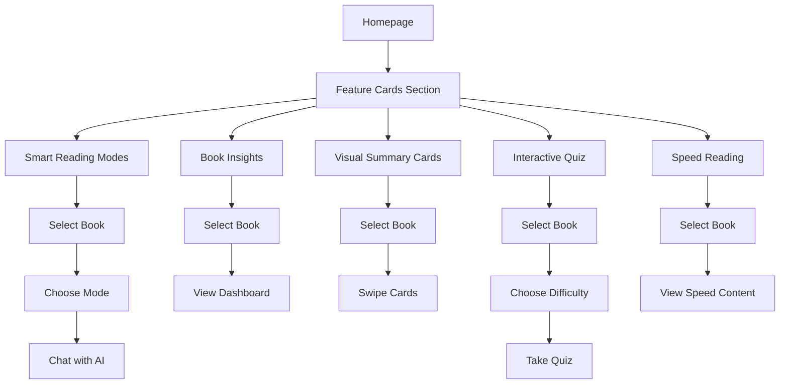

# 🎨 Visual Design Mockup - Homepage with Feature Cards

## Homepage Layout Preview

```
┌─────────────────────────────────────────────────────────────────┐
│                                                                   │
│                    📚 Welcome to Book AI                         │
│                                                                   │
│        Upload your books and chat with AI trained on             │
│                      their content                               │
│                                                                   │
│                    ～～～～～～～～～～                          │
│                   ～～～～～～～～～～～                         │
│                  ～～～～～～～～～～～～                        │
│                                                                   │
└─────────────────────────────────────────────────────────────────┘

┌─────────────────────────────────────────────────────────────────┐
│                                                                   │
│            ✨ Explore Your Books in New Ways ✨                  │
│                                                                   │
│     Discover powerful features to help you understand and        │
│              retain book content faster                          │
│                                                                   │
├─────────────────────────────────────────────────────────────────┤
│                                                                   │
│  ┌──────────────┐  ┌──────────────┐  ┌──────────────┐          │
│  │              │  │              │  │              │          │
│  │      📖      │  │      📊      │  │      🎴      │          │
│  │              │  │              │  │              │          │
│  │    Smart     │  │     Book     │  │    Visual    │          │
│  │   Reading    │  │   Insights   │  │   Summary    │          │
│  │    Modes     │  │  Dashboard   │  │    Cards     │          │
│  │              │  │              │  │              │          │
│  │ Choose how   │  │ Visual over- │  │ Swipeable    │          │
│  │ you consume  │  │ view of key  │  │ story-style  │          │
│  │ content      │  │ concepts     │  │ cards        │          │
│  │              │  │              │  │              │          │
│  │   [→]        │  │   [→]        │  │   [→]        │          │
│  └──────────────┘  └──────────────┘  └──────────────┘          │
│                                                                   │
│  ┌──────────────┐  ┌──────────────┐                             │
│  │              │  │              │                             │
│  │      🎯      │  │      ⚡      │                             │
│  │              │  │              │                             │
│  │ Interactive  │  │    Speed     │                             │
│  │     Quiz     │  │   Reading    │                             │
│  │     Mode     │  │  Assistant   │                             │
│  │              │  │              │                             │
│  │ Test your    │  │ Extract key  │                             │
│  │ comprehen-   │  │ points and   │                             │
│  │ sion         │  │ absorb fast  │                             │
│  │              │  │              │                             │
│  │   [→]        │  │   [→]        │                             │
│  └──────────────┘  └──────────────┘                             │
│                                                                   │
└─────────────────────────────────────────────────────────────────┘

┌─────────────────────────────────────────────────────────────────┐
│                                                                   │
│                      📤 Upload a Book                            │
│                                                                   │
│  ┌─────────────────────────────────────────────────────────┐   │
│  │                                                           │   │
│  │         Drag and drop your book here                     │   │
│  │              or click to browse                          │   │
│  │                                                           │   │
│  │         Supports: PDF, TXT, DOCX                         │   │
│  │                                                           │   │
│  └─────────────────────────────────────────────────────────┘   │
│                                                                   │
└─────────────────────────────────────────────────────────────────┘

┌─────────────────────────────────────────────────────────────────┐
│                                                                   │
│                      📚 Your Library                             │
│                                                                   │
│  [Book 1]  [Book 2]  [Book 3]  ...                              │
│                                                                   │
└─────────────────────────────────────────────────────────────────┘
```

---

## Feature Card Specifications

### Card Design Details

**Dimensions:**
- Desktop: 3 columns (33% width each)
- Tablet: 2 columns (50% width each)
- Mobile: 1 column (100% width)
- Height: Auto (min 280px)
- Gap: 24px between cards

**Visual Style:**
```
┌────────────────────────────────┐
│ Gradient Background            │
│ (Blue/Purple/Pink/Green/Yellow)│
│                                │
│         📖 (6rem icon)         │
│                                │
│    Smart Reading Modes         │
│    (1.25rem, serif font)       │
│                                │
│  Choose how you consume        │
│  content: Quick, Deep, or      │
│  Story mode                    │
│  (0.875rem, gray-600)          │
│                                │
│                          [→]   │
└────────────────────────────────┘
```

**Hover Effects:**
- Scale: 1.05 (5% larger)
- Shadow: xl (large shadow)
- Border: Gray-900 (dark border)
- Arrow: Appears from right
- Transition: 300ms smooth

**Color Gradients:**
1. Smart Reading Modes: `from-blue-50 to-blue-100`
2. Book Insights: `from-purple-50 to-purple-100`
3. Visual Summary Cards: `from-pink-50 to-pink-100`
4. Interactive Quiz: `from-green-50 to-green-100`
5. Speed Reading: `from-yellow-50 to-yellow-100`

---

## Responsive Breakpoints

### Desktop (lg: 1024px+)
```
┌─────────────────────────────────────────┐
│  [Card 1]  [Card 2]  [Card 3]          │
│  [Card 4]  [Card 5]                    │
└─────────────────────────────────────────┘
```

### Tablet (md: 768px - 1023px)
```
┌─────────────────────────────┐
│  [Card 1]  [Card 2]        │
│  [Card 3]  [Card 4]        │
│  [Card 5]                  │
└─────────────────────────────┘
```

### Mobile (< 768px)
```
┌───────────────┐
│   [Card 1]    │
│   [Card 2]    │
│   [Card 3]    │
│   [Card 4]    │
│   [Card 5]    │
└───────────────┘
```

---

## Feature Pages Preview

### 1. Smart Reading Modes Page

```
┌─────────────────────────────────────────────────────────────┐
│  Smart Reading Modes: [Book Title]                          │
│  Choose how you want to explore this book                   │
├─────────────────────────────────────────────────────────────┤
│                                                              │
│  Reading Mode:  [⚡ Quick] [🔍 Deep Dive] [📚 Story]       │
│                                                              │
├─────────────────────────────────────────────────────────────┤
│                                                              │
│  💬 Chat Interface                                          │
│                                                              │
│  [Messages appear here with mode-specific formatting]       │
│                                                              │
│  ┌────────────────────────────────────────────────────┐    │
│  │ Ask a question...                            [Send]│    │
│  └────────────────────────────────────────────────────┘    │
│                                                              │
└─────────────────────────────────────────────────────────────┘
```

### 2. Book Insights Dashboard

```
┌─────────────────────────────────────────────────────────────┐
│  Book Insights: [Book Title]                                │
├─────────────────────────────────────────────────────────────┤
│                                                              │
│  📊 Main Themes                                             │
│  ┌──────┐ ┌──────┐ ┌──────┐ ┌──────┐                      │
│  │Theme1│ │Theme2│ │Theme3│ │Theme4│                      │
│  └──────┘ └──────┘ └──────┘ └──────┘                      │
│                                                              │
│  👥 Key Characters                                          │
│  • Character 1 - Description                                │
│  • Character 2 - Description                                │
│  • Character 3 - Description                                │
│                                                              │
│  💬 Important Quotes                                        │
│  ┌────────────────────────────────────────────────────┐    │
│  │ "Quote 1..."                                       │    │
│  └────────────────────────────────────────────────────┘    │
│  ┌────────────────────────────────────────────────────┐    │
│  │ "Quote 2..."                                       │    │
│  └────────────────────────────────────────────────────┘    │
│                                                              │
│  ☁️ Word Cloud                                              │
│  [Visual word cloud with key terms]                         │
│                                                              │
└─────────────────────────────────────────────────────────────┘
```

### 3. Visual Summary Cards

```
┌─────────────────────────────────────────────────────────────┐
│  Visual Summary Cards: [Book Title]                         │
├─────────────────────────────────────────────────────────────┤
│                                                              │
│              ● ● ● ○ ○ ○ ○ ○ ○ ○                          │
│                                                              │
│         ┌────────────────────────────────┐                  │
│         │                                │                  │
│         │           📖                   │                  │
│         │                                │                  │
│         │      Main Theme Title          │                  │
│         │                                │                  │
│         │  Description of the concept    │                  │
│         │  in an engaging, visual way    │                  │
│         │  that's easy to understand     │                  │
│         │                                │                  │
│         │                                │                  │
│         │  [←]    3 / 10    [→]         │                  │
│         │                                │                  │
│         └────────────────────────────────┘                  │
│                                                              │
│         Swipe or use arrows to navigate                     │
│                                                              │
└─────────────────────────────────────────────────────────────┘
```

### 4. Interactive Quiz Mode

```
┌─────────────────────────────────────────────────────────────┐
│  Interactive Quiz: [Book Title]                             │
│  Difficulty: [Easy] [Medium] [Hard]                         │
├─────────────────────────────────────────────────────────────┤
│                                                              │
│  Question 3 of 10                                           │
│  ━━━━━━━━━━━━━━━━━━━━━━━━━━━━━━━━━━━━━━━━━━━━━━━━━━━━━━  │
│                                                              │
│  What is the main theme of Chapter 2?                       │
│                                                              │
│  ○ A) Theme A                                               │
│  ○ B) Theme B                                               │
│  ○ C) Theme C                                               │
│  ○ D) Theme D                                               │
│                                                              │
│  [Submit Answer]                                            │
│                                                              │
│  ┌────────────────────────────────────────────────────┐    │
│  │ ✓ Correct! (or ✗ Incorrect)                       │    │
│  │                                                     │    │
│  │ Explanation: The correct answer is B because...    │    │
│  └────────────────────────────────────────────────────┘    │
│                                                              │
│  Score: 2/3 (67%)                                           │
│                                                              │
│  [Next Question]                                            │
│                                                              │
└─────────────────────────────────────────────────────────────┘
```

### 5. Speed Reading Assistant

```
┌─────────────────────────────────────────────────────────────┐
│  Speed Reading: [Book Title]                                │
│  [All] [Chapter 1] [Chapter 2] [Chapter 3] ...              │
├─────────────────────────────────────────────────────────────┤
│                                                              │
│  ⚡ TL;DR                                                   │
│  ┌────────────────────────────────────────────────────┐    │
│  │ One-paragraph summary of the entire book...        │    │
│  └────────────────────────────────────────────────────┘    │
│                                                              │
│  🎯 Key Sentences                                           │
│  1. "Most important sentence from the book..."              │
│  2. "Second most important sentence..."                     │
│  3. "Third most important sentence..."                      │
│  ...                                                         │
│                                                              │
│  📚 Important Terms                                         │
│  ┌────────────────────────────────────────────────────┐    │
│  │ Term 1: Definition and explanation                 │    │
│  └────────────────────────────────────────────────────┘    │
│  ┌────────────────────────────────────────────────────┐    │
│  │ Term 2: Definition and explanation                 │    │
│  └────────────────────────────────────────────────────┘    │
│                                                              │
│  📖 Chapter Summaries                                       │
│  ▼ Chapter 1: Title                                         │
│    Brief summary of chapter 1...                            │
│  ▼ Chapter 2: Title                                         │
│    Brief summary of chapter 2...                            │
│                                                              │
│  [Export as PDF] [Share]                                    │
│                                                              │
└─────────────────────────────────────────────────────────────┘
```

---

## User Flow Diagram



---

## Color Palette

### Feature Card Colors
- **Smart Reading Modes**: Blue gradient (#EFF6FF → #DBEAFE)
- **Book Insights**: Purple gradient (#FAF5FF → #F3E8FF)
- **Visual Summary Cards**: Pink gradient (#FDF2F8 → #FCE7F3)
- **Interactive Quiz**: Green gradient (#F0FDF4 → #DCFCE7)
- **Speed Reading**: Yellow gradient (#FEFCE8 → #FEF9C3)

### Text Colors
- Primary: #111827 (Gray-900)
- Secondary: #4B5563 (Gray-600)
- Muted: #9CA3AF (Gray-400)

### Interactive Elements
- Hover: #111827 (Gray-900)
- Active: #1F2937 (Gray-800)
- Border: #E5E7EB (Gray-200)

---

## Typography

### Font Families
- **Headers**: Serif font (elegant, book-like)
- **Body**: Sans-serif (readable, modern)
- **Code**: Monospace (technical content)

### Font Sizes
- Hero Title: 3.75rem (60px)
- Section Title: 2.25rem (36px)
- Card Title: 1.25rem (20px)
- Body Text: 0.875rem (14px)
- Small Text: 0.75rem (12px)

---

## Animation Specifications

### Card Hover Animation
```css
transition: all 300ms cubic-bezier(0.4, 0, 0.2, 1);
transform: scale(1.05);
box-shadow: 0 20px 25px -5px rgba(0, 0, 0, 0.1);
```

### Page Transitions
```css
fade-in: opacity 0 → 1 (500ms)
slide-up: translateY(20px) → 0 (400ms)
```

### Loading States
```css
spinner: rotate 360deg (1s infinite)
pulse: opacity 0.5 ↔ 1 (2s infinite)
```

---

## Accessibility Features

- **Keyboard Navigation**: All cards accessible via Tab key
- **Screen Reader**: Proper ARIA labels on all interactive elements
- **Color Contrast**: WCAG AA compliant (4.5:1 minimum)
- **Focus Indicators**: Visible focus rings on interactive elements
- **Alt Text**: Descriptive text for all icons and images

---

## Mobile Optimization

### Touch Targets
- Minimum size: 44x44px
- Spacing: 8px between elements
- Swipe gestures: Enabled for cards

### Performance
- Lazy loading: Images and components
- Code splitting: Route-based chunks
- Compression: Gzip/Brotli enabled

---

**This design ensures a beautiful, functional, and accessible experience across all devices!** 🎨✨